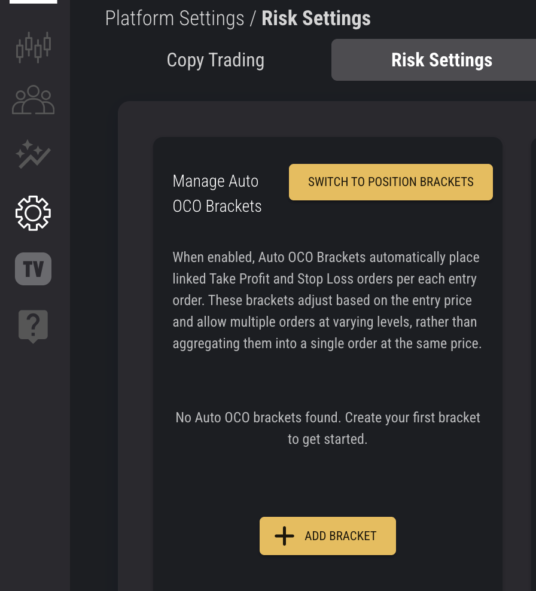
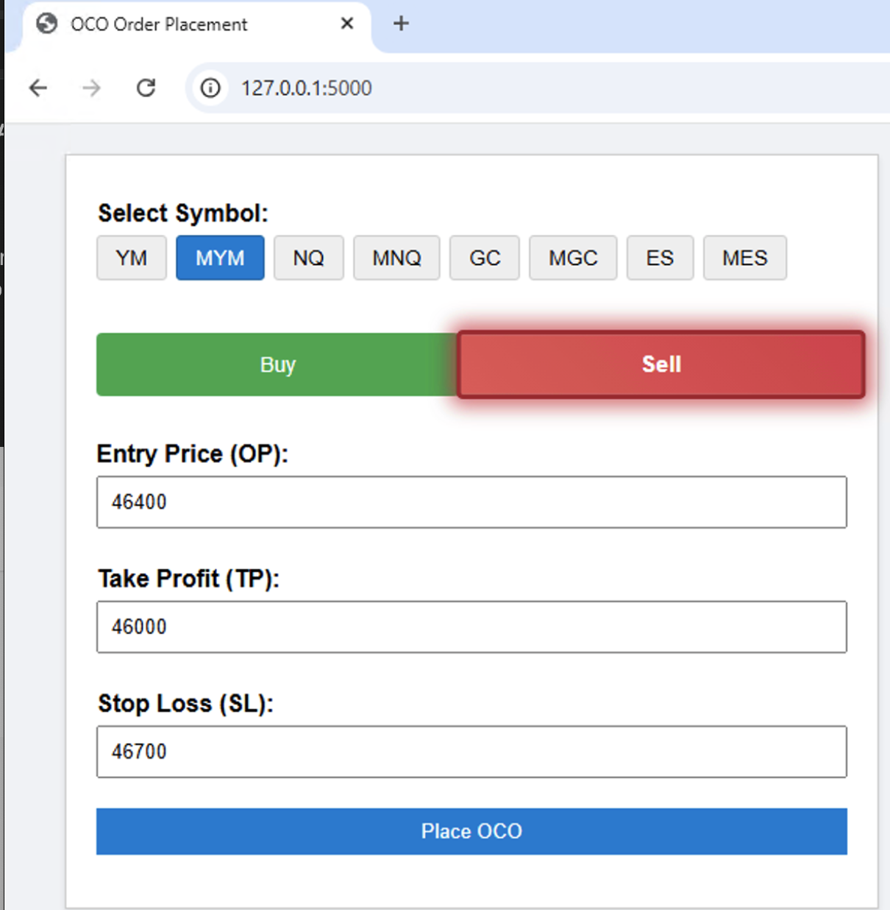
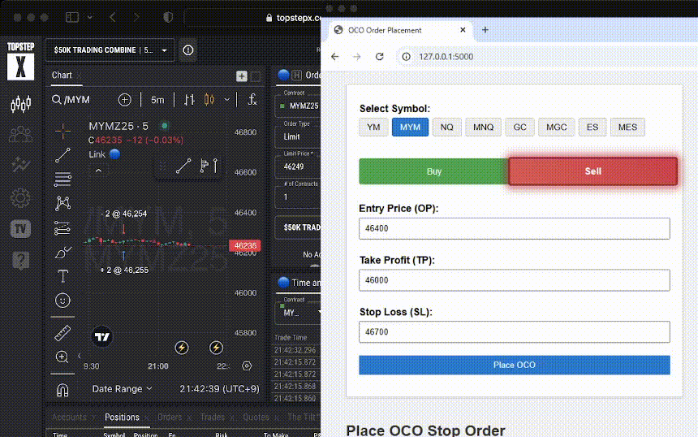

# 📈 TSX-API Integration

This project provides a streamlined interface to interact with the [TopStepX API](https://gateway.docs.projectx.com/docs/getting-started/authenticate/authenticate-api-key), including account discovery, order placement, and OCO bracket management and auto contract sizing money management on backend.

## 🔐 API Access

To use the API, you’ll need to purchase access and obtain credentials:

- 🔑 [Purchase API Key](https://help.topstep.com/en/articles/11187768-topstepx-api-access)
- 📚 [API Documentation](https://gateway.docs.projectx.com/docs/getting-started/authenticate/authenticate-api-key)

## ⚙️ Setup

### Step 1: Create `config.yaml`

```yaml
username: "your_username"
api_key: "your_api_key"
```

### Step 2: Discover Your Account ID

```bash
python account_id.py
```

You’ll see output like:

```text
First active account ID: 123456
```

### Step 3: Update `config.yaml`

```yaml
username: "your_username"
api_key: "your_api_key"
account_id: "123456"
```

## Atuto OCO Bracket Setting


## 🚀 Quart API Server

```bash
python tsx_api_server.py
```

The server runs on:

```text
http://localhost:5000
```

## 🧠 Available Endpoints

### `/place-oco`
Place an OCO bracket with a **limit entry** order.

```json
{
  "symbol": "MYM",
  "quantity": 1,
  "op": 39500.0,
  "tp": 39700.0,
  "sl": 39300.0
}
```

### `/place-oco-stop`
Place an OCO bracket with a **stop-market entry** order.

```json
{
  "symbol": "MYM",
  "quantity": -1,
  "op": 39450.0,
  "tp": 39200.0,
  "sl": 39600.0
}
```

### `/place-oco-with-cancel`
Place an OCO bracket and cancel linked orders if the entry fails.

```json
{
  "symbol": "MYM",
  "quantity": 1,
  "op": 39500.0,
  "tp": 39700.0,
  "sl": 39300.0
}
```

## 🧪 Testing

```bash
python test_oco.py
```

You can toggle between limit and stop entry by changing the endpoint in the script.

## 🛠 Features

- ✅ Account discovery  
- ✅ Limit and stop-market entry OCO brackets  
- ✅ Linked order cancellation logic  
- ✅ Configurable contract and credentials  
- ✅ Simple RESTful interface via Quart  

## 🤝 Contributing

Feel free to fork, extend, or submit pull requests. This project is designed to be modular and easy to adapt for automated trading workflows.

## 📬 Support

For API-related issues, visit:  

[TopStep Support](https://help.topstep.com)  

For code questions or enhancements, open an issue or reach out directly.

## 🖼 Screenshots & Demo

  

